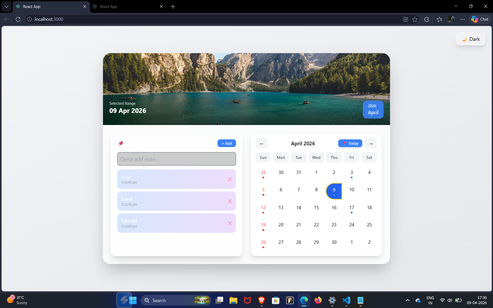
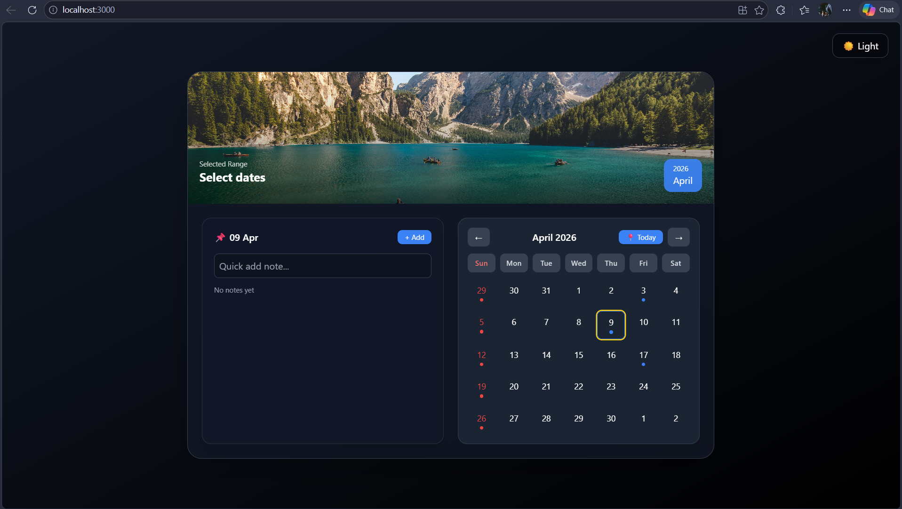

# 🚀 Interactive Wall Calendar

A modern, interactive calendar application built with **React + Tailwind CSS**, focused on real-world usability and product-level user experience.

---

## 🌐 Live Demo

👉 https://interactive-wall-calendar-rho.vercel.app

---


## 📸 Preview
### Light Mode


### Dark Mode

---

## ✨ Features

### 📅 Advanced Date Selection

* Click and drag to select date ranges
* Smooth visual highlighting
* Keyboard navigation (arrow keys + Enter)
* “Today” quick jump button

### 🧠 Smart Notes System

* Notes stored per date
* Persistent using localStorage
* Visual indicators for notes

### 🎯 Interactive UX

* Drag-based selection (rare feature)
* Smooth animations (Framer Motion)
* Micro-interactions (hover, click effects)

### 🎨 UI / UX Enhancements

* Dark / Light mode toggle
* Glassmorphism UI
* Responsive layout
* Event & holiday indicators

---

## 🛠 Tech Stack

* React.js
* Tailwind CSS
* Framer Motion
* date-fns

---

## 🚀 Getting Started

```bash
npm install
npm start
```

---

## 📦 Build

```bash
npm run build
```

---

## 🧠 What I Focused On

* Building a **real-world usable product**, not just UI
* Smooth and intuitive user interactions
* Combining UX + functionality (drag, keyboard navigation)
* Clean and modern design

---

## 📬 Author

Vinay Pal
GitHub: https://github.com/vinay7376
